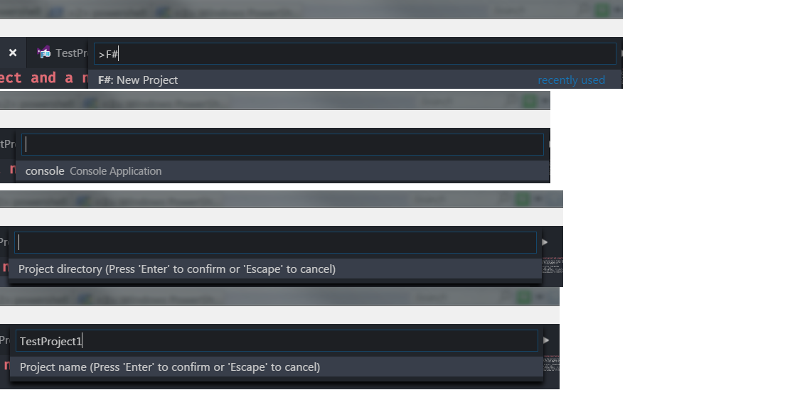
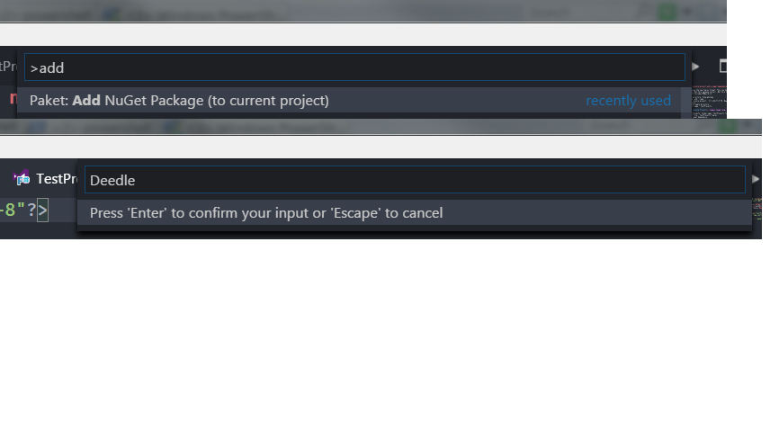
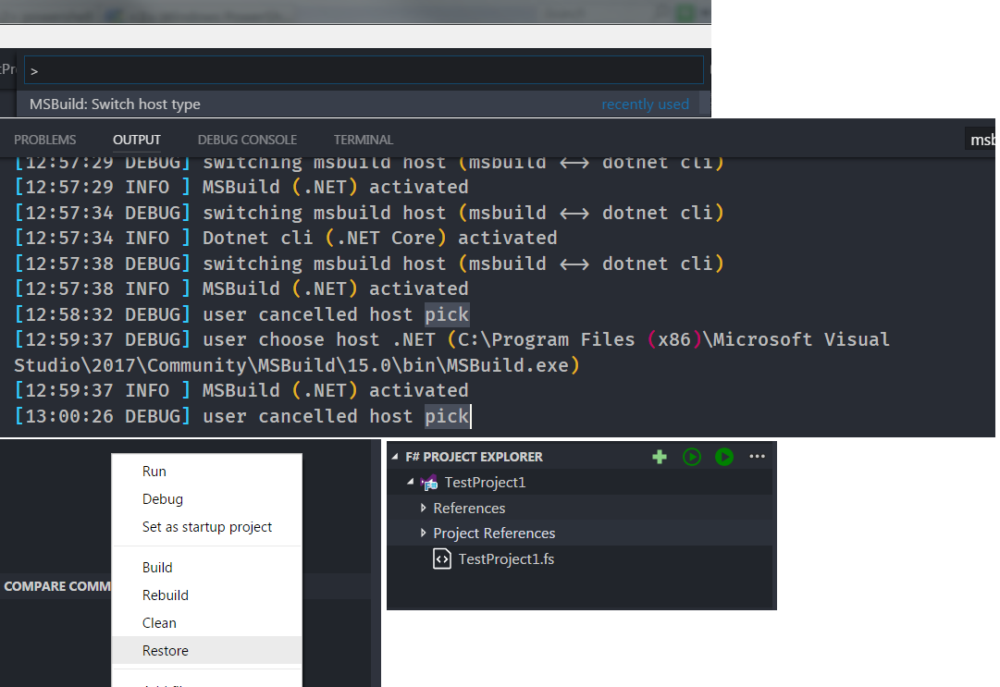

# Bootstrap an F# console project and a nuget dependency

Ionide in VSCode uses the new fsproj format. This can be used with MSBuild 15 to compile for full framework and also .Net Core (please install .Net Core SDK 2). Mono users should install Mono 5.4 as well or above which includes MSBuild 15.

* Create an empty directory `FsharpVsCode`  
* cd `FsharpVsCode` and  `code .`   
* Create a new F# console project: `Ctrl+Shift+P F#: New Project`
    * Select `console`
    * Hit Enter with empty directory
    * Enter Project name: `TestProject1`



* Wait until the project structure is created, paket and fake downloaded
* Inside the `TestProject1` folder open `TestProject1.fs`
* Open the project file: `TestProject1.fsproj`
* Add `Deedle` as nuget dependency:
    * `Ctrl+Shift+P Paket: Add Nuget Package (to current project)`
    * Add `Deedle`  
* Wait until the dependency is downloaded and added to the `paket.dependencies` and `paket.references` files  

   

* Next we need to select the MSBuild host and restore the packages. Either right-click in the F# Project Explorer or with `Ctrl+Shift+P`:
    * `MSBuild: Switch host type` Select (.NET) pr .NET Core if building for .NET Core SDK
    * `MSBuild: Restore project`



* Edit TestProject1.fs to `open Deedle`  and add 
```
    let x = Series.ofValues [1;2;3] 
    printfn "%A" x
```
* `MSBuild: Build project or Build Current Project`   
* Run the exe:   
```
    λ .\TestProject1.exe
    series [ 0 => 1; 1 => 2; 2 => 3]
```


## Troubleshooting:  
* To refresh Ionide's cache use `Ctrl+Shift+P F# Clean Cache` 
* To refresh the VSCode window use `Ctrl+Shift+P F# Reload Window` 

## To clone this repo:
* `git clone https://github.com/s952163/FSharpVSCode.git`
* Enter the created directory: `cd FSharpVSCode` and start `code .` (Or just open the folder in Code)
* Just as above Restore the project
* Build the Project